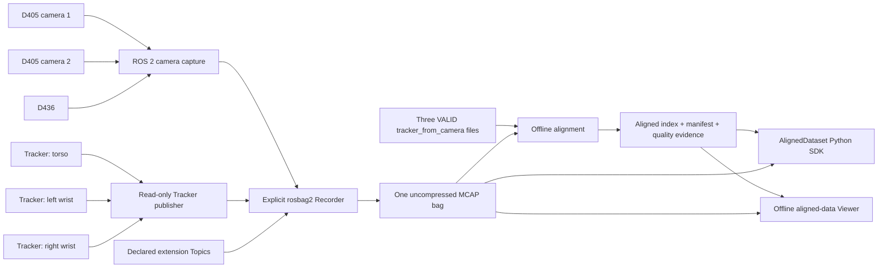

# VisionTactile-Dataset

[](https://github.com/yanglei18/VisionTactile-Dataset/actions/workflows/ci.yml)


[](LICENSE)

[简体中文](README.zh-CN.md) ·
[User manual](docs/user-manual.md) ·
[Interfaces](docs/interface-reference.md) ·
[Troubleshooting](docs/troubleshooting.md)

Reproducible ROS 2 acquisition and offline alignment for **three Intel
RealSense cameras** and **three VIVE Ultimate Trackers**.

The repository provides the software needed to acquire two D405 cameras, one
D436 camera, and three read-only Tracker pose streams into one explicit MCAP
bag. Separate offline tools calibrate each fixed Tracker-to-camera pair and
produce an auditable, host-time-aligned dataset index without modifying the raw
bag.

> [!IMPORTANT]
> This is acquisition and post-processing software, not a downloadable
> dataset. Recorded bags, device credentials, Tracker bootstrap material,
> role maps, and rig-specific extrinsics are deliberately kept outside Git.

## Why this project exists

Multi-device experiments often fail silently: the wrong physical device is
assigned to a logical role, ROS QoS drops a stream, a camera clock resets, or a
Recorder exits successfully even though the resulting data are unusable. This
project makes those boundaries explicit:

- cameras are bound by model, serial number, firmware, and ASIC identity;
- Tracker samples are bound to stable experiment roles and physical IDs;
- recording uses an exact, wildcard-free Topic allowlist;
- source clocks and host clocks remain distinguishable;
- Recorder lifecycle success and dataset quality are separate verdicts;
- calibration and alignment outputs are immutable and independently
  verifiable.

## Features

| Capability | Status | Entry point |
| --- | --- | --- |
| Two D405 + one D436 capture | Available | `vt_realsense_capture` |
| Per-camera color/depth timing groups | Available | `CameraFrameTiming` |
| Three-Tracker read-only ROS 2 publisher | Available with private runtime inputs | `vt_vive_tracker` |
| RViz2 and standalone Tracker visualization | Available | `vt_vive_tracker`, `vt_vive_tracker_gui` |
| Unified 15-Topic MCAP recording | Available | `capture_controller` |
| Tracker-to-camera hand-eye calibration | Available offline | `tools/tracker_camera_calibration/` |
| Three-camera/three-Tracker alignment | Available offline | `tools/multisensor_alignment/` |
| Indexed Python access to aligned frames | Available offline | `AlignedDataset` |
| Aligned RGB/Depth/Tracker dashboard | Available offline | `vt-multisensor-view` |
| Future glove or auxiliary streams | Configurable generic adapter | `recording.additional_streams` |
| Cross-camera hardware exposure sync | Not claimed | — |
| Online extrinsic TF or point-cloud fusion | Not implemented | — |

## System overview



The online path only acquires and records data. Tracker-to-camera calibration
and multisensor alignment are independent offline operations.

## Unified bag contract

The default production bag contains **15 Topics**:

| Count | ROS type | Topics |
| ---: | --- | --- |
| 6 | `sensor_msgs/msg/Image` | color and depth for `d405_1`, `d405_2`, and `d436` |
| 3 | `sensor_msgs/msg/CameraInfo` | color intrinsics for all three cameras |
| 3 | `vt_camera_msgs/msg/CameraFrameTiming` | `/d405_1/frame_timing`, `/d405_2/frame_timing`, `/d436/frame_timing` |
| 3 | `vt_tracker_msgs/msg/TrackerSample` | `/vive/left_wrist/sample`, `/vive/right_wrist/sample`, `/vive/torso/sample` |

All core Topics use `keep-last`, depth `30`, `best-effort`, `volatile` recording
QoS overrides. Additional streams must be declared by exact Topic and ROS type;
the Recorder never uses `--all` or wildcard discovery.

The Recorder writes MCAP with rosbag and MCAP compression disabled. At the
reference `1280×720@30` configuration, six raw image streams have an arithmetic
planning rate of approximately **414.72 MB/s**, or **124.4 GB per 300 seconds**.
This estimate is for storage planning, not a throughput guarantee.

`COMPLETE` means that the Recorder process lifecycle ended cleanly. It does
**not** mean that the bag passed identity, timing, coverage, or experimental
quality checks.

## Supported reference system

| Component | Reference configuration |
| --- | --- |
| Operating system | Ubuntu 24.04 |
| ROS distribution | ROS 2 Jazzy |
| RealSense wrapper | RealSense ROS 4.58.1 |
| Cameras | 2 × D405 + 1 × D436 |
| Camera streams | RGB8 + Z16, 1280×720 at 30 Hz |
| Tracking | 3 × VIVE Ultimate Tracker + Wireless Dongle |
| Tracker setup | Windows 10/11 mapping and pairing completed first |
| Bag storage | rosbag2 MCAP, no online compression |

Tested camera identities, firmware versions, and USB topology guidance are
documented in the [hardware reference](docs/hardware-reference.md). A different
camera, firmware, ROS distribution, PyVUT revision, or USB controller is an
unvalidated hardware combination until the acceptance procedure is repeated.

## Quick start

### 1. Clone the repository

```bash
git clone --recurse-submodules \
  https://github.com/yanglei18/VisionTactile-Dataset.git
cd VisionTactile-Dataset

export VT_REPO="$(pwd -P)"
export VT_WS="${VT_REPO}/ros2_ws"
export VT_DATA_ROOT="${HOME}/visiontactile-data"
mkdir -p "${VT_DATA_ROOT}"
git -C "${VT_REPO}" submodule update --init --recursive
```

Keep bags, calibration runs, extrinsics, role maps, bootstrap bundles, and
validation reports outside `VT_REPO`.

### 2. Install the public dependencies

Install ROS 2 Jazzy before running the following commands:

```bash
sudo apt update
sudo apt install -y \
  git \
  python3-colcon-common-extensions \
  python3-venv \
  python3-yaml \
  python3-tk \
  ros-jazzy-realsense2-camera \
  ros-jazzy-ros2bag \
  librealsense2-utils \
  fio

source /opt/ros/jazzy/setup.bash
# Run `sudo rosdep init` once if rosdep has not been initialized on this host.
rosdep update
rosdep install --from-paths ros2_ws/src --ignore-src -r -y \
  --rosdistro jazzy
```

Use the system ROS Python environment. An active Conda environment is not a
supported build or runtime configuration.

### 3. Build and test

```bash
source /opt/ros/jazzy/setup.bash
cd "${VT_WS}"
colcon build --event-handlers console_direct+
source install/setup.bash
colcon test --event-handlers console_direct+
colcon test-result --all --verbose
```

Proceed to hardware operation only when the test result contains zero errors
and zero failures.

### 4. Run the three cameras without recording

```bash
source /opt/ros/jazzy/setup.bash
source "${VT_WS}/install/setup.bash"
ros2 launch vt_realsense_capture triple_realsense.launch.py \
  output_root:="${VT_DATA_ROOT}"
```

Launching the camera stack does not create a bag. Recording begins only after
the controller accepts a manual `START` command. Use the
[capture guide](docs/capture-guide.md) to check the six image streams, three
CameraInfo streams, and three timing streams before recording.

### 5. Prepare the Tracker publisher

The public repository does not pair Trackers, create a Windows map, update
firmware, or generate private bootstrap credentials. Before Linux publication:

1. complete pairing, mapping, and relocalization on Windows;
2. run the documented Linux validation sequence;
3. provide an approved bootstrap bundle and role map outside the repository;
4. finish the manual bootstrap, then start the read-only publisher.

```bash
: "${VT_BUNDLE:?set VT_BUNDLE to the approved bundle}"
: "${VT_ROLE_MAP:?set VT_ROLE_MAP to the private role map}"

ros2 launch vt_vive_tracker triple_tracker.launch.py \
  bundle_path:="${VT_BUNDLE}" \
  role_map_path:="${VT_ROLE_MAP}"
```

See the [Windows map procedure](docs/tracker-windows-map.md),
[Linux validation guide](docs/tracker-linux-validation.md), and
[Tracker publisher runbook](docs/tracker-ros2-publisher.md) for the full trust
boundary and startup sequence.

### 6. Record one unified session

Start the Tracker publisher first, keep the camera launch running, and verify
all 15 core Topics. Then send a unique request:

```bash
ros2 topic pub --once /capture/command \
  vt_camera_msgs/msg/CaptureCommand \
  "{request_id: run-001, command: 1, session_label: trial, planned_duration_sec: 300}"
```

Observe the lifecycle:

```bash
ros2 topic echo /capture/status
```

The successful state sequence is:

```text
IDLE -> RECORDING -> FINALIZING -> COMPLETE
```

To stop early, use a new request ID and wait for `COMPLETE`:

```bash
ros2 topic pub --once /capture/command \
  vt_camera_msgs/msg/CaptureCommand \
  "{request_id: stop-001, command: 2, session_label: '', planned_duration_sec: 0}"
```

Inspect the finalized bag with:

```bash
ros2 bag info "${VT_DATA_ROOT}/<session-id>/bag"
```

### 7. Align the bag offline

Alignment requires three identity-bound calibration results with
`status: VALID`. Install the offline tool in an isolated environment that can
still access the ROS installation:

```bash
source /opt/ros/jazzy/setup.bash
source "${VT_WS}/install/setup.bash"
python3 -m venv --system-site-packages "${HOME}/.venvs/vt-alignment"
source "${HOME}/.venvs/vt-alignment/bin/activate"
sudo apt-get install python3-tk
python -m pip install "${VT_REPO}/tools/multisensor_alignment[viewer]"

vt-multisensor-align --version
vt-multisensor-view --version
```

Copy the example configuration outside Git, bind it to the real hardware and
Topic identities, then run:

```bash
export BAG="${VT_DATA_ROOT}/<session-id>/bag"
export ALIGN_CONFIG="${VT_DATA_ROOT}/config/alignment.yaml"
export EXTRINSICS_DIR="${VT_DATA_ROOT}/calibration/accepted"
export ALIGN_OUTPUT="${VT_DATA_ROOT}/<session-id>/aligned-v01"

vt-multisensor-align inspect \
  --bag "${BAG}" \
  --config "${ALIGN_CONFIG}"

vt-multisensor-align align \
  --bag "${BAG}" \
  --config "${ALIGN_CONFIG}" \
  --extrinsics "${EXTRINSICS_DIR}" \
  --output "${ALIGN_OUTPUT}"

vt-multisensor-align validate --output "${ALIGN_OUTPUT}"
```

The tool does not rewrite or decode the raw image payloads. It produces an
atomic alignment directory containing a manifest, stream catalog, JSONL frame
index, timing residuals, quality report, diagnostic plot, and integrity hashes.
Follow the [single-entry alignment manual](tools/multisensor_alignment/README.md)
for configuration, acceptance thresholds, output semantics, and recovery.

### 8. Read aligned frames in Python

The same package provides an integrity-checked reader. It keeps images in the
original MCAP bag and resolves only the frame payloads requested by the caller:

```python
import os
from vt_multisensor_alignment import AlignedDataset

with AlignedDataset.open(
    os.environ["ALIGN_OUTPUT"],
    os.environ["BAG"],
) as dataset:
    frame = dataset.frame(
        0,
        cameras=("d405_1", "d436"),
        image_kinds=("color", "depth"),
        include_timing=False,
        additional_streams=(),
    )
    rgb = frame.cameras["d405_1"].color.array
    depth = frame.cameras["d405_1"].depth.array
    torso_matrix = frame.trackers["torso"].world_from_tracker.as_matrix()
```

The reader validates the alignment export and source-bag identity by default,
preserves missing aligned values as `None`, returns read-only NumPy images, and
supports optimized forward iteration with `dataset.iter_frames()`. See the
[Python SDK chapter](tools/multisensor_alignment/README.md#10-使用-python-sdk-读取对齐数据)
for CameraInfo, extension streams, cache behavior, errors, depth units, and
multi-worker usage.

### 9. Visualize the aligned dataset offline

The same package provides a read-only dashboard for all three RGB/depth pairs
and the three aligned Tracker poses:

```bash
vt-multisensor-view \
  --alignment "${ALIGN_OUTPUT}" \
  --bag "${BAG}"
```

Playback follows alignment reference time and skips only intermediate display
updates when rendering falls behind, so latency does not accumulate. Pausing
still allows exact frame-by-frame inspection. A desktop is not required to
export a deterministic audit snapshot:

```bash
vt-multisensor-view \
  --alignment "${ALIGN_OUTPUT}" \
  --bag "${BAG}" \
  --start 100 \
  --export-frame "${VT_DATA_ROOT}/<session-id>/frame-000100.png"
```

The full controls, fixed depth/Tracker scales, integrity behavior, and recovery
steps are in the
[offline Viewer chapter](tools/multisensor_alignment/README.md#11-离线可视化).

## Time and transform semantics

The project does not treat every timestamp as interchangeable.

| Stream | Alignment time | Independent audit time |
| --- | --- | --- |
| Camera frame group | `group_host_realtime_ns` | `group_host_monotonic_raw_ns` |
| Tracker sample | `host_realtime_ns` | `host_monotonic_ns` |
| Generic extension | configured header or integer nanosecond field | none unless a typed adapter provides one |

Camera device/source timestamps remain provenance fields. In particular, a
D436 device-clock reset must not redefine the dataset wall-clock timeline.
`CLOCK_MONOTONIC_RAW` and `CLOCK_MONOTONIC` are audited within their own
streams; their numeric values are never compared directly.

The offline transform convention is:

```text
vive_map_from_camera = vive_map_from_tracker * tracker_from_camera
```

Each external calibration is bound to one camera identity, one Tracker role
and physical ID, and the expected parent/child frames. Invalid, mismatched, or
ambiguous calibration files are rejected.

## Extending the dataset contract

Future motion-capture gloves and other ROS streams can join the same bag
without changing the 15-Topic core:

1. add the exact Topic and ROS type to `recording.additional_streams` in the
   capture configuration;
2. add the same stream identity and timestamp field to the alignment
   configuration;
3. choose bounded `nearest` or causal `previous` selection;
4. mark the stream required only when its coverage must gate acceptance;
5. version and preserve the resulting configuration with the dataset evidence.

The current generic adapter selects a whole serialized message reference. It
does not perform glove-joint interpolation; a typed adapter should be added
after the glove message contract is stable.

## Repository layout

```text
VisionTactile-Dataset/
├── ros2_ws/src/
│   ├── vt_camera_msgs/          # Camera timing and capture interfaces
│   ├── vt_realsense_capture/    # Three-camera launch and Recorder controller
│   ├── vt_tracker_msgs/         # Tracker sample/status interfaces
│   ├── vt_vive_tracker/         # Read-only Tracker publisher and RViz client
│   └── vt_vive_tracker_gui/     # Standalone Tracker visualization
├── tools/
│   ├── tracker_camera_calibration/ # Offline hand-eye calibration
│   ├── multisensor_alignment/      # Alignment + Python SDK + offline Viewer
│   ├── vut_validation/             # Tracker validation utilities
│   └── check_public_tree.py        # Public-release repository gate
├── docs/                        # Architecture, operations, and troubleshooting
├── third_party/pyvut/           # Pinned PyVUT Git submodule
├── CONTRIBUTING.md
├── SECURITY.md
└── LICENSE
```

Build outputs (`build/`, `install/`, `log/`), bags, packet captures, generated
calibrations, private Tracker inputs, and experimental artifacts are not source
files and must not be committed.

## Documentation

### Operate the system

- [Release-grade end-user manual](docs/user-manual.md)
- [Unified capture guide](docs/capture-guide.md)
- [Launch arguments, Topics, QoS, and CLI reference](docs/interface-reference.md)
- [Hardware reference and USB topology](docs/hardware-reference.md)
- [Troubleshooting by symptom](docs/troubleshooting.md)

### Work with Trackers

- [Windows mapping and pairing boundary](docs/tracker-windows-map.md)
- [Linux validation](docs/tracker-linux-validation.md)
- [ROS 2 Tracker publisher and visualization](docs/tracker-ros2-publisher.md)

### Calibrate and align

- [Tracker-to-camera calibration overview](docs/tracker-camera-calibration.md)
- [Complete calibration operations manual](tools/tracker_camera_calibration/README.md)
- [Complete unified-bag alignment manual](tools/multisensor_alignment/README.md)
- [Aligned-data Python SDK](tools/multisensor_alignment/README.md#10-使用-python-sdk-读取对齐数据)
- [Aligned-data offline Viewer](tools/multisensor_alignment/README.md#11-离线可视化)
- [Architecture and data flow](docs/architecture.md)

### Develop and release

- [Contributing guide](CONTRIBUTING.md)
- [Maintainer release checklist](docs/release-checklist.md)
- [Changelog](CHANGELOG.md)
- [Security policy](SECURITY.md)
- [Third-party notices](THIRD_PARTY_NOTICES.md)

## Verification

The repository CI builds all five ROS 2 packages and runs the public-tree,
Tracker validation, calibration, and alignment/SDK test suites. The alignment
tests include MCAP round trips using real ROS message serialization and verify
random versus sequential SDK reads.

Useful local checks are:

```bash
cd "${VT_WS}"
colcon test --event-handlers console_direct+
colcon test-result --all --verbose

cd "${VT_REPO}"
PYTHONPATH=tools/tracker_camera_calibration/src \
  python3 -m unittest discover -s tools/tracker_camera_calibration/tests -v
PYTHONPATH=tools/multisensor_alignment/src \
  python3 -m unittest discover -s tools/multisensor_alignment/tests -v
python3 tools/test_check_public_tree.py
python3 tools/check_public_tree.py
```

Automated tests do not replace the reference-hardware acceptance procedure.
For a release or a new hardware combination, run the documented 30-second and
300-second camera/Tracker recording checks, inspect the resulting bag, and
validate the offline alignment output.

## Scope and known limitations

- There is no cross-camera hardware trigger or simultaneous-exposure claim.
- `CameraFrameTiming` is exact color/depth software grouping within one camera,
  not proof of exposure synchronization across cameras.
- Tracker coordinates remain in the Windows-created native `vive_map`; the
  publisher does not emit extrinsic TF.
- Tracker pairing, mapping, firmware updates, and private bootstrap generation
  are outside the Linux read-only publisher.
- Calibration bags are separate from production bags. Three physical
  Tracker-to-camera transforms must be calibrated and accepted for each rig.
- The alignment tool matches host realtime with bounded residuals and reports
  coverage. It does not manufacture missing observations or extrapolate poses.
- Point-cloud fusion, online alignment, and typed glove interpolation are not
  part of this release.

## Contributing

Contributions are welcome. Before opening a pull request:

1. read [CONTRIBUTING.md](CONTRIBUTING.md);
2. keep generated data and private hardware material out of Git;
3. add or update tests for behavioral changes;
4. update the relevant interface and operations documentation;
5. run the ROS, offline-tool, and public-tree checks.

Use GitHub Issues for reproducible, non-sensitive defects and feature requests.
Report vulnerabilities or credential exposure only through the private process
in [SECURITY.md](SECURITY.md).

## License and third-party software

Project-authored source and documentation are licensed under
[Apache-2.0](LICENSE). The `third_party/pyvut` submodule and all other third-party
components retain their respective upstream licenses and are not relicensed by
this project. See [THIRD_PARTY_NOTICES.md](THIRD_PARTY_NOTICES.md) before
redistributing a combined build.

## Citation

When using this software in a publication or released dataset, cite the exact
Git commit and configuration alongside the repository URL:

```bibtex
@software{visiontactile_dataset,
  title  = {VisionTactile-Dataset},
  author = {VisionTactile-Dataset contributors},
  year   = {2026},
  url    = {https://github.com/yanglei18/VisionTactile-Dataset}
}
```
